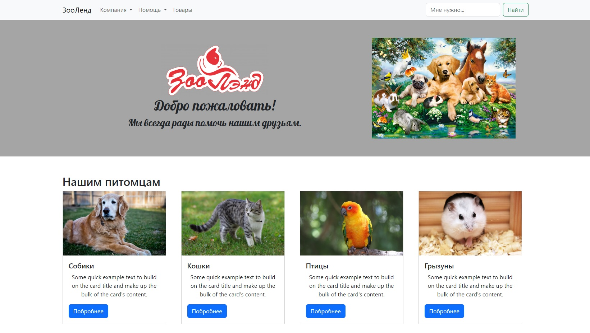
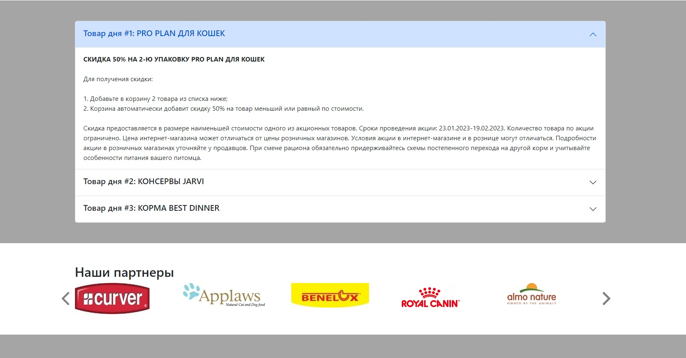
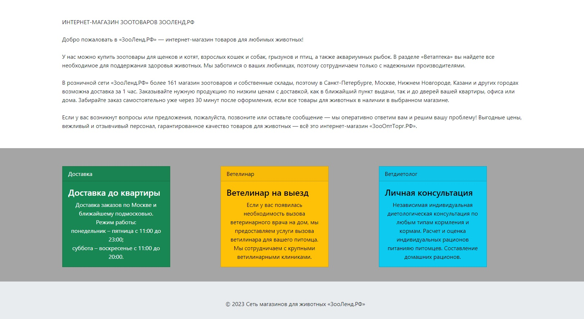

# Pet shop on bootstrap
___

In the work used:
* Cross-browser layout.
* Semantics of tags.
* Validity.
* Layout of hidden text description.
* Availability (WCAG).
* Use tags to style elements.
* Errors loading images.
* Basics of SEO (meta tags).

### Bootstrap blocks used:

* Adaptive container;
* Navigation;
* Maps;
* Accordion;
* Slider;

### Animation cards
Animation maps (180* vertical rotation) implemented in pure css using the pseudo-class [hover](https://developer.mozilla.org/en/docs/Web/CSS/:hover) property the [transitions](https://developer.mozilla.org/en-US/docs/Web/CSS/transition) and [transform](https://developer.mozilla.org/en-US/docs/Web/CSS/transform).

~~~
.image-flip:hover .backside,
.image-flip.hover .backside {
    transform: rotateY(0deg);
}
.image-flip:hover .frontside,
.image-flip.hover .frontside {
    transform: rotateY(180deg);
}
.image-flip {
    margin-bottom: 20px;
    width: 300px;
    height: 250px;
}
.card-img-top {
    height: 190px;
}
.mainflip {
    transition: 1s;
    transform-style: preserve-3d;
    position: relative;
}
.frontside,
.backside {
    backface-visibility: hidden;
    transition: 1s;
    transform-style: preserve-3d;
    position: absolute;
    top: 0;
    left: 0;
}
.frontside {
    z-index: 2;
}
.backside {
    transform: rotateY(-180deg);
}
~~~

# Зоомагазин на bootstrap
___

В работе использованы:
* Кроссбраузерная верстка.
* Семантика тегов.
* Период действия.
* Макет скрытого текстового описания.
* Доступность (WCAG).
* Используйте теги для стилизации элементов.
* Ошибки загрузки изображений.
* Основы SEO (метатеги).

### Использованы блоки bootstrap:

* Адаптивный контейнер;
* Навигация;
* Карты;
* Аккордеон;
* Слайдер;

### Анимационные карты
Анимационные карты при наведении (поворот на 180* по вертикале) реализованны на чистом css с помощью псевдокласса [hover](https://developer.mozilla.org/ru/docs/Web/CSS/:hover) применяя свойства [transitions](https://developer.mozilla.org/en-US/docs/Web/CSS/transition) и [transform](https://developer.mozilla.org/en-US/docs/Web/CSS/transform).

