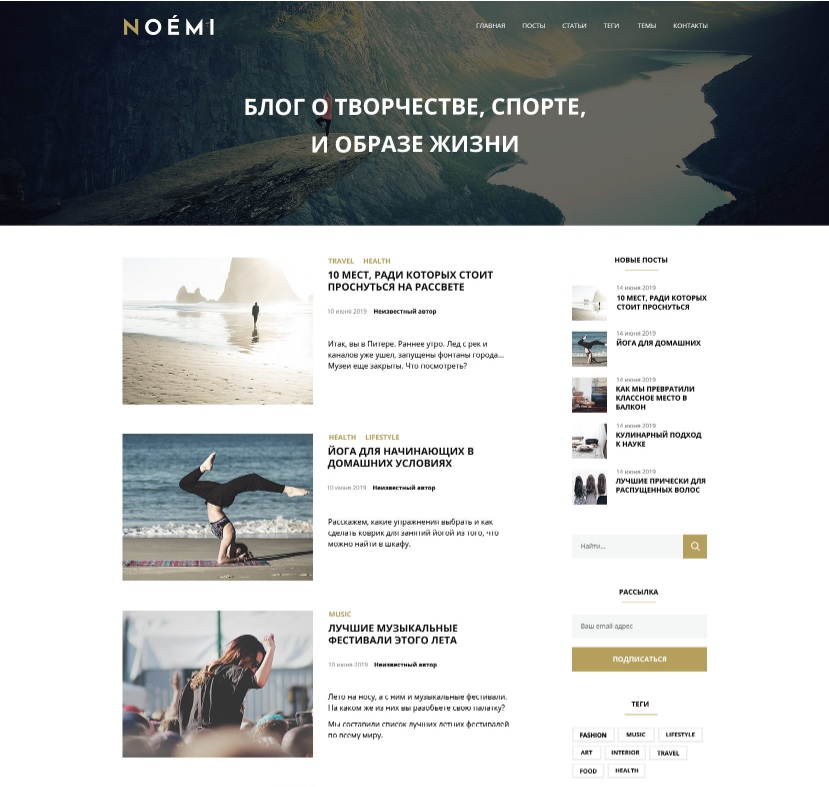

# Landing page
___

The work used:
* Cross-browser layout.
* Semantics of tags.
* Validity.
* Layout hidden text description.
* Accessibility (WCAG).
* Use tags to style elements.
* Adding less or more content to blocks.
* The height of the elements should be calculated according to the content.
* Requirements for the behavior of elements in the project.
* Errors loading images.
* Layout of decorative lines for headings.
* Layout mask for images.
* Compliance layout layout.
* Basics of SEO (meta tags).

### Crossbrowser layout
___
The designed layout is displayed correctly on computers running Microsoft Windows and macOS operating systems.

In addition to supporting the main types of OS, layout also works correctly in the latest versions of browsers:

* Google Chrome;
* Mozilla Firefox;
*Microsoft Edge;
*Opera;
*Safari.

### Semantic use of tags
___
When laying out a project, preference is given to tags that make sense. For example, the "News" section is defined by the section tag:
~~~
<section class="news">
   <h2>News</h2>
</section>
~~~

### Semantic attribute names
___
In addition to using semantic tags, you also need to give semantic names to attribute values. It is forbidden to use transliteration.

_Correct name example:_
~~~
  <header class="header"></header>
  ~~~
When naming classes, you can use the accepted list of [classes](https://github.com/yoksel/common-words).

### Compliance of the layout with the layout
___
The final project is a copy of the layout from the designer.

Implementation may differ:

* font thickness in browsers and photoshop;
* intercharacter distance;
* differences in padding - up to 3px.

### Image loading errors
___
When laying out images, a situation is provided when, for some reason, they will not load.

* In the case of content images, the layout does not break, and instead of the image, alternative text is displayed, from which it is clear what was shown in the picture.
* For decorative images, a text background has been selected so that the text is readable in any situation.

### Layout of hidden text
___
Visual textual description of input fields for work
Screen-reader is not provided by the designer.
The text is hidden using the visually-hidden class.
~~~
.visually-hidden {
  position: absolute;
  width: 1px;
  height: 1px;
  margin: -1px;
  padding: 0;
  border: 0;
  clip: rect(0 0 0 0);
  overflow: hidden;
} 
~~~

# Верстка лендинга
___

В работе использовались:
* Кроссбраузерная вёрстка.
* Семантика тегов.
* Валидность.
* Вёрстка скрытого текстового описания.
* Доступность (Screen reader и Screen magnification).
* Использование тегов для стилизации элементов.
* Добавление меньшего или большего количества контента в блоки.
* Высота элементов должна рассчитываться по контенту.
* Требования к поведению элементов в проекте.
* Ошибки загрузки изображений.
* Вёрстка декоративных линий у заголовков.
* Вёрстка маски для изображений.
* Соответствие вёрстки макету.
* Основы SEO (метатеги).

### Кроссбраузерная вёрстка
___
Свёрстанный макет корректно отображается на компьютерах с операционными системами Microsoft Windows и macOS.

Кроме поддержки основных типов ОС вёрстка также работает корректно в последних версиях браузеров:

* Google Chrome;
* Mozilla FireFox;
* Microsoft Edge;
* Opera;
* Safari.

### Семантическое использование тегов
___
При вёрстке проекта преимущество отдаётся тегам, имеющим смысл. Например, раздел «Новости» задается тегом section:
~~~
<section class="news">
  <h2>Новости</h2>
</section>
~~~

### Семантические названия атрибутов
___
Кроме использования семантических тегов также нужно давать семантические названия значениям атрибутов. Запрещается использовать транслит.

_Пример корректного названия:_
~~~
 <header class="header"></header>
 ~~~
При именовании классов можно использовать принятый список [классов](https://github.com/yoksel/common-words).

### Соответствие вёрстки макету
___
Итоговый проект является копией макета от дизайнера. 

При реализации допускаются отличия:

* толщина шрифта в браузерах и фотошопе;
* межсимвольное расстояние;
* различия в отступах — до 3px.

### Ошибки загрузки изображений
___
При вёрстке изображений предусмотрена ситуация, когда по какой-либо причине они не загрузятся.

* В случае контентных изображений вёрстка не ломается, а вместо изображения отображается альтернативный текст, из которого понятно, что было изображено на картинке.
* Для декоративных изображений подобрана подложка для текста, чтобы текст был читаемым в любой ситуации.

### Вёрстка скрытого текстового
___
Визуальное текстовое описание полей ввода для работы
Screen reader не предусмотрено дизайнером.
Текст скрыт, используя класс visually-hidden.
~~~
.visually-hidden {
  position: absolute;
  width: 1px;
  height: 1px;
  margin: -1px;
  padding: 0;
  border: 0;
  clip: rect(0 0 0 0);
  overflow: hidden;
} 
~~~
